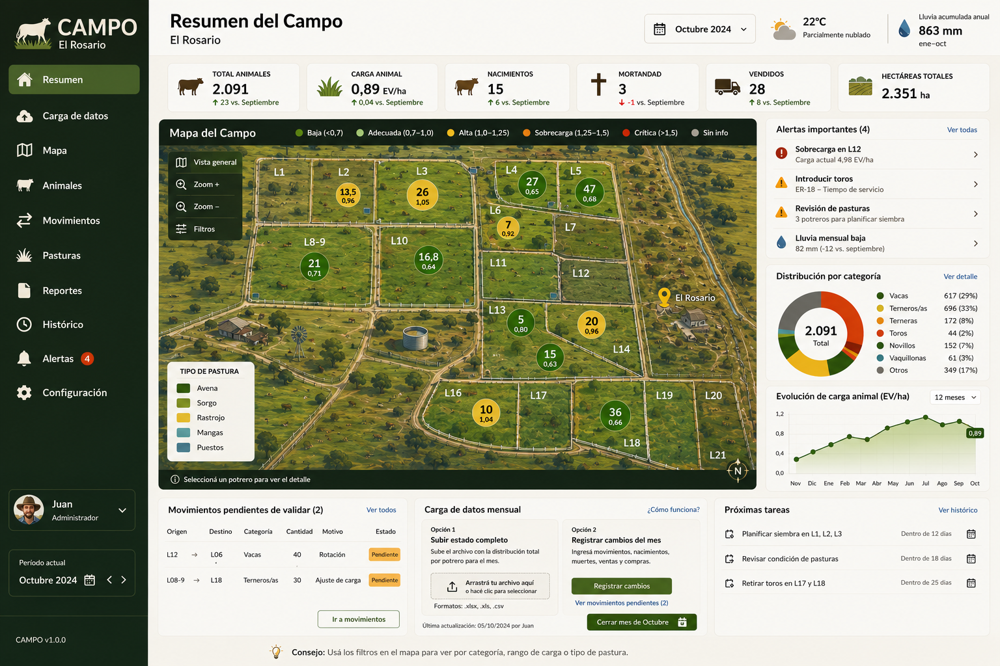

# Campo — El Rosario

MVP de una aplicación web para registrar y analizar el rodeo bovino de **El Rosario**. El diseño prioriza una meta: que la carga mensual de datos sea tan simple que pueda convertirse en un hábito operativo.



## Qué incluye el MVP

- **Resumen del Campo** con mapa compacto, KPIs, cambios mes a mes y alertas.
- **Carga de datos guiada** como segundo módulo de la navegación.
- Matriz editable por lote y categoría, pegado directo desde Excel e importación CSV.
- Versión móvil de carga lote por lote.
- Registro de movimientos, nacimientos, muertes, ventas, compras, reclasificaciones y correcciones.
- Sugerencias automáticas de conciliación entre dos estados mensuales, siempre sujetas a validación del usuario.
- Cierre mensual con resumen y alertas al final del proceso.
- Mapa interactivo con los lotes ER, carga animal, cantidad de animales, cambio mensual y pasturas.
- Histórico mensual y comparación entre períodos.
- Exportaciones CSV y respaldo completo JSON.
- Persistencia local en el navegador mediante IndexedDB, con alternativa automática a localStorage.
- Diseño responsive para escritorio, tablet y teléfono.

## Configuración inicial

- Establecimiento: **El Rosario**
- Superficie configurada: **1.735 ha**
- Carga de referencia: **0,80 EV/ha**
- Factor de terneros y terneras: **0,50 EV**
- Factor de toros reproductores: **1,25 EV**
- Resto de categorías del MVP: **1,00 EV**

Los lotes se mantienen fijos y usan nomenclatura ER. Los lotes combinados son `ER-08/09`, `ER-15/16` y `ER-20/21`.

## Inicio local

Requisitos:

- Node.js 22.12 o superior
- npm

```bash
npm install
npm run dev
```

La terminal mostrará la dirección local para abrir la aplicación.

## Validación y compilación

```bash
npm run preflight
npm run check
npm run build
npm run preview
```

La compilación de producción se genera en `dist/`.

## Publicación

El repositorio incluye un flujo de GitHub Actions en:

```text
.github/workflows/deploy-pages.yml
```

Cada cambio enviado a `main` puede compilar y publicar la app con GitHub Pages. También puede importarse el repositorio directamente en Vercel.

Las instrucciones paso a paso están en [DEPLOYMENT.md](DEPLOYMENT.md).
El resultado de las verificaciones ejecutadas en esta entrega está en [docs/DEPLOYMENT-STATUS.md](docs/DEPLOYMENT-STATUS.md).

## Datos locales: comportamiento importante

La aplicación publicada puede compartirse mediante una URL, pero en este MVP los datos no se sincronizan entre dispositivos. Cada navegador conserva su propia base local.

Antes de cambiar de equipo, navegador o URL de producción:

1. Abra **Exportar y respaldo**.
2. Exporte un respaldo completo JSON.
3. Importe ese archivo en el nuevo dispositivo.

Los CSV sirven para análisis e intercambio tabular. El respaldo JSON es el mecanismo que conserva toda la estructura de la aplicación.

## Plantillas

Las plantillas se encuentran en `csv-templates/`:

- `plantilla-inventario.csv`
- `plantilla-eventos.csv`

La carga manual y el pegado desde Excel también están disponibles desde la aplicación.

`sample-data/` contiene un inventario y eventos ficticios para probar el flujo sin utilizar información real.

## Estructura principal

```text
src/
├── components/       Pantallas y componentes visuales
├── data/             Configuración, datos demo y contexto de aplicación
├── db/               Adaptador de almacenamiento local
├── utils/            Cálculos, CSV y conciliación
├── App.tsx            Navegación y composición principal
└── styles.css         Diseño responsive completo
```

La lógica de negocio está separada del almacenamiento para facilitar una migración futura desde IndexedDB a Supabase.

## Estado de esta entrega

Esta es una primera versión funcional del MVP con datos demostrativos precargados. La prioridad de la siguiente validación es probar el flujo real de carga mensual con una persona que hoy prepara el reporte y medir:

- tiempo hasta completar la carga;
- cantidad de correcciones necesarias;
- claridad de las sugerencias de conciliación;
- uso desde teléfono y tablet;
- utilidad del resumen final.

## Próximas iteraciones previstas

- Supabase y sincronización entre usuarios y dispositivos.
- Pestaña editable de supuestos.
- Calendarios configurables de reproducción y siembra.
- Capacidad estacional por cultivo, suplemento y crecimiento de pastura.
- Fotos por lote y resumen narrativo del cierre mensual.
